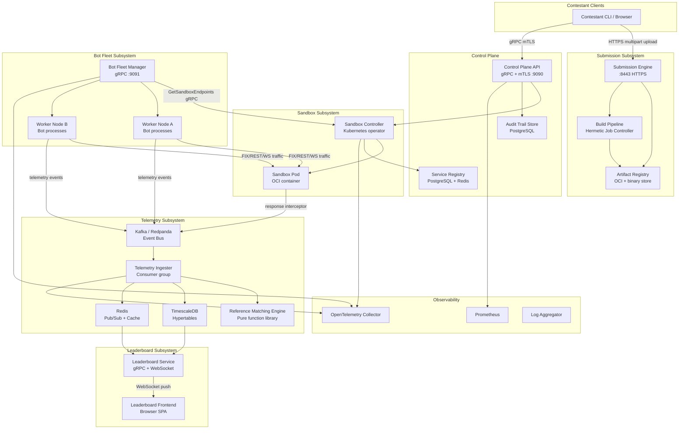
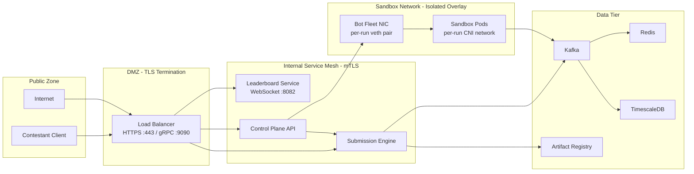
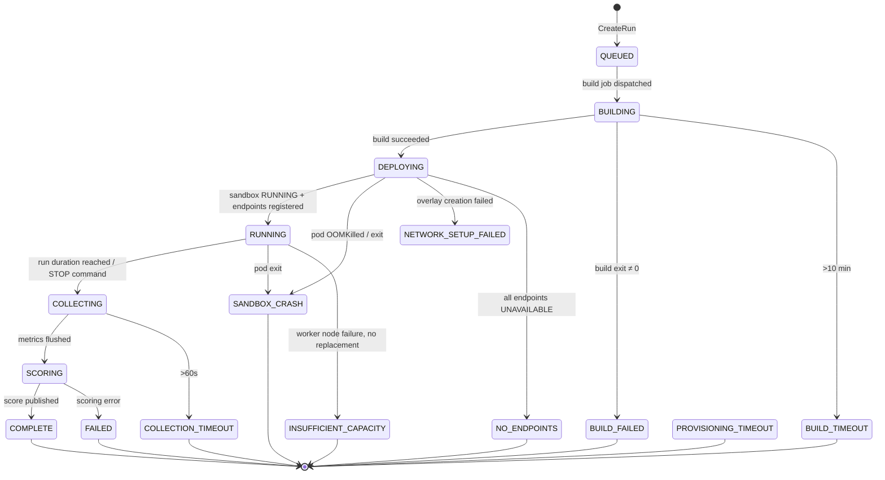
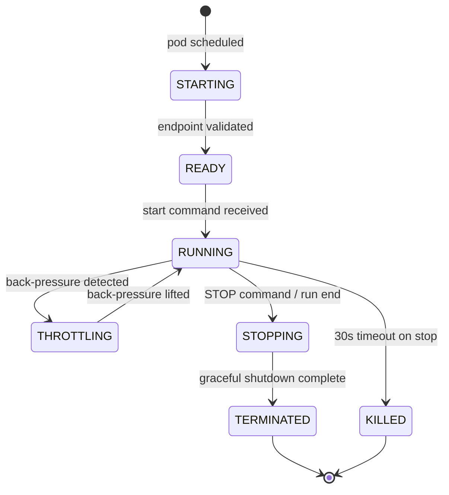
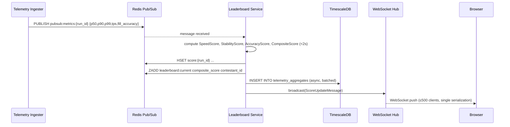

# Design Document: Distributed Benchmarking and Hosting Platform (DBHP)

## Overview

The Distributed Benchmarking and Hosting Platform (DBHP) is a cloud-native microservices system designed to host, evaluate, and rank trading infrastructure submissions for the IICPC Summer Hackathon 2026. It accepts contestant binaries or source code, builds and containerizes them inside hermetic sandboxes, bombards them with a distributed fleet of synthetic HFT bots across FIX/REST/WebSocket protocols, collects sub-millisecond telemetry, validates correctness against a deterministic reference matching engine, computes a composite score, and surfaces live standings to a real-time leaderboard frontend.

The platform is built around a **control plane / data plane separation**: the control plane (gRPC API server, scheduler, orchestrator) coordinates all subsystems and manages state machines, while the data plane carries hot-path workloads — message generation, telemetry streaming, and scoring — at high throughput with minimal control-plane involvement.

Key design drivers:
- **Isolation first**: every sandbox runs in its own cgroup v2 + seccomp-bpf + AppArmor + network-namespace envelope with no cross-tenant sharing.
- **At-least-once telemetry with deduplication**: Kafka consumer groups provide delivery guarantees; composite dedup keys prevent double-counting.
- **Deterministic correctness validation**: the Reference Matching Engine is a pure function; all scoring is reproducible.
- **Horizontal scalability**: bot fleet, telemetry ingestion, and leaderboard fan-out each scale independently via Kubernetes HPA.
- **30-minute IaC deploy SLA**: modular Terraform + Helm with readiness-gated rollout.

---

## Architecture

### High-Level Microservice Topology



### Network Security Boundaries



All east-west traffic within the internal service mesh uses mTLS certificates issued by a platform-managed CA. Sandbox overlay networks are created per Benchmark Run; no two sandboxes share a network namespace or overlay segment.

---

## Components and Interfaces

### 1. Submission Engine

**Responsibilities**: Authenticated artifact ingestion, checksum verification, rate limiting, Artifact Registry push, build-job dispatch.

**HTTP API (HTTPS :8443)**:
```
POST /v1/submissions
  Headers: Authorization: Bearer <contestant-token>
           X-Checksum-SHA256: <hex>
           Content-Type: multipart/form-data
  Body: artifact file
  Responses:
    201 { "submission_id": "uuid", "status": "UPLOADED" }
    401 { "error": "INVALID_TOKEN" }
    413 { "error": "ARTIFACT_TOO_LARGE", "max_bytes": 524288000 }
    415 { "error": "UNSUPPORTED_FORMAT" }
    422 { "error": "CHECKSUM_MISMATCH" }
    429 { "error": "RATE_LIMITED", "Retry-After": <seconds> }
    503 { "error": "REGISTRY_UNAVAILABLE" }

GET /v1/submissions/{submission_id}/status
  Responses:
    200 { "submission_id": "uuid", "status": "<status>", "build_log_url": "..." }
```

**Rate Limiter**: Token-bucket per contestant ID with capacity 5 / 60-minute rolling window, backed by Redis sorted set (contestant_id → sorted set of upload timestamps).

**Artifact Registry Integration**: Pushes OCI images via the distribution-spec v1 API; stores raw binaries as opaque blobs tagged with submission ID.

### 2. Build Pipeline (Hermetic Job Controller)

**Responsibilities**: Spawns a Kubernetes Job per source submission; enforces toolchain pinning, no-network policy, 10-minute timeout; captures build logs; produces OCI image + reproducible manifest.

**Job Spec Key Constraints**:
- `spec.template.spec.automountServiceAccountToken: false`
- `spec.template.spec.securityContext.runAsNonRoot: true`
- Network policy: deny all egress (no outbound; base images pre-pulled to node)
- Init container fetches artifact from Artifact Registry over cluster-internal network
- Build container runs `make` / `cargo build --release` / `go build` depending on detected manifest
- Post-build container runs `ldd` / `objdump` / `go tool nm` to enumerate dynamic deps, then calls `buildah` to assemble minimal OCI image

**Reproducible Manifest Schema**:
```json
{
  "submission_id": "uuid",
  "toolchain": "rustc-1.77.0",
  "compiler_flags": ["--release", "--target=x86_64-unknown-linux-musl"],
  "dependency_hashes": { "libc.so.6": "sha256:abc...", ... },
  "build_timestamp_utc": "2026-07-01T12:00:00Z",
  "image_digest": "sha256:def..."
}
```

### 3. Sandbox Controller (Kubernetes Operator)

**Responsibilities**: CRD-based lifecycle management for `Sandbox` resources; applies seccomp/AppArmor profiles; manages per-run CNI network; polls health-check; updates service registry.

**Custom Resource Definition**:
```yaml
apiVersion: dbhp.iicpc.io/v1alpha1
kind: Sandbox
spec:
  submissionId: string
  benchmarkRunId: string
  cpuCores: 2..8
  memoryLimitGiB: 4
  tmpfsSizeGiB: 1
  maxLifetimeSeconds: 7200
  healthCheckPath: "/health"   # optional
  protocols: [FIX, REST, WS]
status:
  phase: PENDING|RUNNING|UNHEALTHY|CRASHED|COMPLETED|FAILED
  internalIP: string
  endpoints: [{protocol, port, status}]
  terminationReason: string
  exitCode: int
```

**Isolation Implementation**:
- seccomp profile: platform-defined allowlist (read/write/sendmsg/recvmsg/futex/epoll_wait/clock_gettime and ~40 others; deny ptrace/mount/unshare/clone with CLONE_NEWUSER)
- AppArmor profile: deny `/proc/*/mem`, `/sys/kernel`, all raw socket capabilities
- cgroup v2: `memory.max = 4G`, `cpuset.cpus = <dedicated-cores>`, `pids.max = 512`
- Network: dedicated VXLAN overlay; `ip netns` namespace created before pod start; NetworkPolicy restricts ingress to BFM and Telemetry Ingester CIDRs only

**gRPC Interface (internal)**:
```protobuf
service SandboxController {
  rpc GetSandboxEndpoints(GetEndpointsRequest) returns (EndpointList);
  rpc GetSandboxStatus(StatusRequest) returns (SandboxStatus);
  rpc TerminateSandbox(TerminateRequest) returns (google.protobuf.Empty);
}
message GetEndpointsRequest { string benchmark_run_id = 1; }
message EndpointList {
  repeated Endpoint endpoints = 1;
  string not_ready_reason = 2;  // set when gRPC NOT_READY returned
}
message Endpoint {
  string internal_ip = 1;
  uint32 port = 2;
  Protocol protocol = 3;
  string submission_id = 4;
  string benchmark_run_id = 5;
  EndpointStatus status = 6;
}
enum Protocol { FIX = 0; REST = 1; WEBSOCKET = 2; }
enum EndpointStatus { AVAILABLE = 0; UNAVAILABLE = 1; }
```

### 4. Bot Fleet Manager

**Responsibilities**: Provisions and schedules bot worker processes, distributes bots across nodes with load-balance constraint, assigns scenarios, monitors worker health, redistributes on node failure.

**Scheduling Algorithm**:
1. Query Kubernetes node pool tagged `role=bot-worker` for available capacity (`allocatable.cpu`, `allocatable.memory`, current bot count from internal registry).
2. Sort nodes by current bot count ascending (least-loaded first).
3. Assign bots round-robin across eligible nodes while enforcing: `node_bot_count ≤ 500` and `max_node_bots − min_node_bots ≤ fleet_size × 0.10`.
4. For each bot, select scenario using weighted random sampling from `ScenarioDistribution` config, post-checked with a deviation guard: if any scenario is under-represented by >5%, resample until balanced.
5. Deploy bots as Kubernetes Pods on their assigned nodes using `nodeSelector` and `nodeAffinity.requiredDuringSchedulingIgnoredDuringExecution`.

**gRPC Interface**:
```protobuf
service BotFleetManager {
  rpc ProvisionFleet(ProvisionRequest) returns (stream ProvisionEvent);
  rpc StopFleet(StopRequest) returns (google.protobuf.Empty);
  rpc GetFleetStatus(FleetStatusRequest) returns (FleetStatus);
}
message ProvisionRequest {
  string benchmark_run_id = 1;
  uint32 bot_count = 2;
  ScenarioDistribution distribution = 3;
  repeated string endpoint_ids = 4;
}
message ScenarioDistribution {
  float market_maker_pct = 1;
  float aggressive_taker_pct = 2;
  float cancel_spammer_pct = 3;
  float mixed_retail_pct = 4;
  float latency_prober_pct = 5;
}
```

**Worker Node Failure Recovery**:
- Each worker node runs a bot-agent daemon that heartbeats to BFM every 5 seconds.
- If heartbeat is missed for 15 seconds, BFM treats node as unreachable.
- Affected bots are redistributed: find nodes with `available_capacity > displaced_count`; if none found within 45 seconds → `INSUFFICIENT_CAPACITY`.

### 5. Telemetry Ingester

**Responsibilities**: Kafka consumer group ingestion, latency computation, rolling window aggregation, TimescaleDB persistence, Redis pub/sub publishing, correctness validation via RME.

**Back-pressure handling**:
- In-memory ring buffer: 100,000 events.
- At 80% → trigger immediate flush coroutine.
- At 100% → pause Kafka partition consumption (`consumer.pause(partition)`) until buffer < 50%.

**Deduplication**: Before inserting to TimescaleDB, check Redis SET `dedup:{run_id}:{bot_id}:{seq_num}` with TTL = run_duration + 10 min. If key exists → drop; if not → SETEX then insert.

**Rolling latency computation**: Maintains a min-heap per run keyed by `(event_time, latency_us)`. Every 5 seconds, computes p50/p90/p99 over the most recent 60-second window by scanning the heap. At run completion, computes over full population.

### 6. Reference Matching Engine (RME)

**Design principle**: Pure function — no I/O, no global state, no side effects. Implemented as a shared library (`libdbhp_rme.so` / Rust crate) callable by the Telemetry Ingester.

**Interface**:
```rust
pub fn run_matching_engine(orders: &[OrderEvent]) -> MatchResult {
    // Returns fills, rejections, and final order book state
}

pub struct MatchResult {
    pub fills: Vec<FillEvent>,
    pub rejections: Vec<RejectEvent>,
    pub final_book: OrderBook,
}
```

**Order Book Model**:
- Two-sided price-level map: `BTreeMap<Price, VecDeque<Order>>` for bids (descending) and asks (ascending).
- Price-time priority: within each price level, `VecDeque` maintains FIFO insertion order.
- Matching loop: for each incoming order, attempt to cross against the opposite side; generate fill events with matched quantity, price, and both order IDs.
- Determinism guaranteed by: sorted price levels (BTreeMap), FIFO queues (VecDeque), no randomness, no timestamps in matching logic (sequence numbers only).

### 7. Leaderboard Service

**Responsibilities**: Consumes Redis pub/sub for metric updates, computes composite scores, fans out to WebSocket clients, serves initial snapshot via REST, handles Redis fallback to TimescaleDB.

**Score computation** (triggered on metric batch arrival, ≤2 seconds):
```
SpeedScore     = clamp((100 - p99_ms) / 99, 0.0, 1.0)
StabilityScore = clamp(max_tps / 1_000_000, 0.0, 1.0)
AccuracyScore  = fill_accuracy_score (from TI) or 0.0
CompositeScore = 0.35*SpeedScore + 0.35*StabilityScore + 0.30*AccuracyScore
```

**WebSocket Fan-out**: Uses a publish-subscribe hub (Go `broadcast.Hub` or equivalent). Each WebSocket connection subscribes to a shared channel. Score updates are serialized once and broadcast to all 500+ subscribers without per-connection serialization.

**Redis Fallback**: On Redis `ECONNREFUSED` or timeout >100ms → switch to TimescaleDB mode; retry Redis every 30 seconds. Latency budget in fallback: p99 ≤ `normal_p99 + 500ms` (Requirement 13.6).

**REST Initial Snapshot**:
```
GET /v1/leaderboard?page=1&page_size=100
  Response: { "entries": [...], "total": N, "computed_at": "ISO8601" }
```

**WebSocket Push Schema**:
```json
{
  "type": "SCORE_UPDATE",
  "benchmark_run_id": "uuid",
  "contestant_handle": "string",
  "rank": 3,
  "composite_score": 0.874,
  "speed_score": 0.912,
  "stability_score": 0.850,
  "accuracy_score": 0.855,
  "p99_latency_ms": 1.9,
  "max_tps": 850000,
  "fill_accuracy_pct": 85.5,
  "run_status": "IN_PROGRESS",
  "timestamp": "2026-07-01T14:23:05.123Z"
}
```

### 8. Control Plane API

**gRPC Service Definitions**:
```protobuf
service ContestantService {
  rpc RegisterContestant(RegisterRequest) returns (Contestant);
  rpc IssueToken(IssueTokenRequest) returns (TokenResponse);
  rpc RevokeToken(RevokeRequest) returns (google.protobuf.Empty);
}

service SubmissionService {
  rpc GetSubmissionStatus(SubmissionStatusRequest) returns (SubmissionStatus);
  rpc GetBuildLog(BuildLogRequest) returns (stream BuildLogChunk);
}

service BenchmarkService {
  rpc CreateRun(CreateRunRequest) returns (BenchmarkRun);
  rpc GetRun(GetRunRequest) returns (BenchmarkRun);
  rpc ListRuns(ListRunsRequest) returns (BenchmarkRunList);
  rpc CancelRun(CancelRunRequest) returns (google.protobuf.Empty);
}

service LeaderboardService {
  rpc GetLeaderboard(LeaderboardRequest) returns (LeaderboardPage);
  rpc GetContestantScore(ContestantScoreRequest) returns (ContestantScore);
  rpc StreamLeaderboard(StreamRequest) returns (stream LeaderboardUpdate);
}
```

**mTLS Certificate Pools**:
- `contestant-ca`: issues certs for contestant CLI clients
- `operator-ca`: issues certs for operator tooling
- `internal-ca`: issues certs for service-to-service (Submission Engine ↔ Control Plane, BFM ↔ Sandbox Controller, etc.)

**Benchmark Run State Machine**:


Each transition is written to the `benchmark_run_audit` PostgreSQL table (see Data Models).

---

## Data Models

### PostgreSQL / TimescaleDB Schema

#### contestants
```sql
CREATE TABLE contestants (
    id            UUID PRIMARY KEY DEFAULT gen_random_uuid(),
    handle        TEXT NOT NULL UNIQUE,
    email         TEXT NOT NULL UNIQUE,
    created_at    TIMESTAMPTZ NOT NULL DEFAULT now(),
    updated_at    TIMESTAMPTZ NOT NULL DEFAULT now()
);

CREATE TABLE contestant_tokens (
    id            UUID PRIMARY KEY DEFAULT gen_random_uuid(),
    contestant_id UUID NOT NULL REFERENCES contestants(id),
    token_hash    BYTEA NOT NULL UNIQUE,   -- SHA-256(token)
    issued_at     TIMESTAMPTZ NOT NULL DEFAULT now(),
    expires_at    TIMESTAMPTZ,
    revoked       BOOLEAN NOT NULL DEFAULT false
);
```

#### submissions
```sql
CREATE TABLE submissions (
    id              UUID PRIMARY KEY DEFAULT gen_random_uuid(),
    contestant_id   UUID NOT NULL REFERENCES contestants(id),
    artifact_type   TEXT NOT NULL CHECK (artifact_type IN ('ELF_BINARY','SOURCE_ARCHIVE')),
    artifact_size   BIGINT NOT NULL,
    checksum_sha256 BYTEA NOT NULL,
    status          TEXT NOT NULL DEFAULT 'UPLOADED',
    artifact_uri    TEXT,         -- Artifact Registry path
    image_digest    TEXT,         -- OCI image sha256
    build_log_uri   TEXT,
    created_at      TIMESTAMPTZ NOT NULL DEFAULT now(),
    updated_at      TIMESTAMPTZ NOT NULL DEFAULT now()
);
CREATE INDEX idx_submissions_contestant ON submissions(contestant_id);
```

#### submission_rate_limits
```sql
-- One row per (contestant_id, window start) — managed by Submission Engine
CREATE TABLE submission_rate_limits (
    contestant_id UUID NOT NULL REFERENCES contestants(id),
    upload_time   TIMESTAMPTZ NOT NULL,
    PRIMARY KEY (contestant_id, upload_time)
);
```

#### benchmark_runs
```sql
CREATE TABLE benchmark_runs (
    id              UUID PRIMARY KEY DEFAULT gen_random_uuid(),
    contestant_id   UUID NOT NULL REFERENCES contestants(id),
    submission_id   UUID NOT NULL REFERENCES submissions(id),
    status          TEXT NOT NULL DEFAULT 'QUEUED',
    bot_count       INT NOT NULL,
    created_at      TIMESTAMPTZ NOT NULL DEFAULT now(),
    started_at      TIMESTAMPTZ,
    completed_at    TIMESTAMPTZ,
    composite_score NUMERIC(7,6),
    speed_score     NUMERIC(7,6),
    stability_score NUMERIC(7,6),
    accuracy_score  NUMERIC(7,6)
);
CREATE INDEX idx_runs_contestant ON benchmark_runs(contestant_id);
CREATE INDEX idx_runs_status ON benchmark_runs(status);
```

#### benchmark_run_audit
```sql
CREATE TABLE benchmark_run_audit (
    id              BIGSERIAL PRIMARY KEY,
    benchmark_run_id UUID NOT NULL REFERENCES benchmark_runs(id),
    prior_state     TEXT NOT NULL,
    new_state       TEXT NOT NULL,
    actor_identity  TEXT NOT NULL,
    failure_reason  TEXT,
    recorded_at     TIMESTAMPTZ NOT NULL DEFAULT now()
);
CREATE INDEX idx_audit_run ON benchmark_run_audit(benchmark_run_id);
```

#### TimescaleDB Hypertables (Telemetry)

```sql
-- Raw latency samples
CREATE TABLE telemetry_samples (
    benchmark_run_id  UUID       NOT NULL,
    bot_id            UUID       NOT NULL,
    seq_num           BIGINT     NOT NULL,
    protocol          TEXT       NOT NULL,  -- FIX | REST | WS
    send_ts_ns        BIGINT     NOT NULL,  -- nanosecond send timestamp
    recv_ts_ns        BIGINT     NOT NULL,  -- nanosecond receive timestamp
    latency_us        NUMERIC    GENERATED ALWAYS AS ((recv_ts_ns - send_ts_ns) / 1000.0) STORED,
    request_id        TEXT       NOT NULL,
    error_code        TEXT,
    event_time        TIMESTAMPTZ NOT NULL DEFAULT now(),
    PRIMARY KEY (benchmark_run_id, bot_id, seq_num)
);
SELECT create_hypertable('telemetry_samples', 'event_time',
    partitioning_column => 'benchmark_run_id',
    number_partitions => 16);

-- Aggregated rolling window metrics
CREATE TABLE telemetry_aggregates (
    benchmark_run_id  UUID        NOT NULL,
    window_start      TIMESTAMPTZ NOT NULL,
    window_end        TIMESTAMPTZ NOT NULL,
    p50_latency_us    NUMERIC,
    p90_latency_us    NUMERIC,
    p99_latency_us    NUMERIC,
    max_tps           BIGINT,
    error_rate        NUMERIC,
    sample_count      BIGINT,
    PRIMARY KEY (benchmark_run_id, window_start)
);
SELECT create_hypertable('telemetry_aggregates', 'window_start');

-- Fill events for correctness validation
CREATE TABLE fill_events (
    benchmark_run_id  UUID        NOT NULL,
    order_id          TEXT        NOT NULL,
    fill_ts           TIMESTAMPTZ NOT NULL,
    filled_qty        NUMERIC     NOT NULL,
    fill_price        NUMERIC     NOT NULL,
    side              TEXT        NOT NULL,  -- BUY | SELL
    violation_flags   TEXT[],               -- PRICE_PRIORITY_VIOLATION etc.
    is_correct        BOOLEAN     NOT NULL,
    PRIMARY KEY (benchmark_run_id, order_id, fill_ts)
);
SELECT create_hypertable('fill_events', 'fill_ts',
    partitioning_column => 'benchmark_run_id',
    number_partitions => 16);

-- TimescaleDB compression policy (7 days)
SELECT add_compression_policy('telemetry_samples', INTERVAL '7 days');
SELECT add_compression_policy('fill_events', INTERVAL '7 days');
SELECT add_retention_policy('telemetry_samples', INTERVAL '30 days');
SELECT add_retention_policy('fill_events', INTERVAL '30 days');
```

### Redis Data Structures

| Key Pattern | Type | TTL | Purpose |
|---|---|---|---|
| `rate_limit:{contestant_id}` | Sorted Set (score=timestamp, member=timestamp) | 3600s | Upload rate limiting |
| `dedup:{run_id}:{bot_id}:{seq}` | String | run_ttl + 600s | Telemetry event deduplication |
| `metrics:{run_id}` | Hash | run_ttl + 3600s | Latest aggregated metrics (p50/p90/p99/tps/err_rate) |
| `score:{run_id}` | Hash | 7 days | Composite + component scores |
| `leaderboard:current` | Sorted Set (score=composite, member=contestant_id) | live | Live rankings |
| `leaderboard:snapshot:{ts}` | String (JSON) | 3600s | Paginated snapshot for initial HTTP fetch |
| `pubsub:metrics:{run_id}` | Pub/Sub channel | — | Metric update fan-out to Leaderboard Service |
| `pubsub:leaderboard` | Pub/Sub channel | — | Score update fan-out to WebSocket clients |
| `session:{run_id}:endpoints` | Hash | run_ttl | Endpoint registry cache |

---

## Kafka / Redpanda Topic Design

### Topic Structure

| Topic | Partitions | Key | Retention | Consumer Groups |
|---|---|---|---|---|
| `telemetry.raw.{env}` | 64 | `benchmark_run_id` | 24h | `telemetry-ingester` |
| `telemetry.fills.{env}` | 32 | `benchmark_run_id` | 24h | `telemetry-ingester` |
| `sandbox.events.{env}` | 16 | `benchmark_run_id` | 48h | `control-plane`, `telemetry-ingester` |
| `build.events.{env}` | 8 | `submission_id` | 72h | `control-plane` |
| `scoring.updates.{env}` | 16 | `contestant_id` | 24h | `leaderboard-service` |
| `alerts.{env}` | 4 | `alert_type` | 7 days | `alerting-sink` |

### Partitioning Strategy

`telemetry.raw` is partitioned by `benchmark_run_id` (64 partitions) to ensure all events from a single run are consumed in-order by the same ingester instance. Partitions are pre-assigned to ingester replicas using Kafka's cooperative-sticky rebalance protocol, minimizing rebalance pauses during scale-out.

Key serialization: Kafka message key = `benchmark_run_id` as raw UTF-8 bytes; partition = `murmur2(key) % num_partitions`.

### Telemetry Event Schema (Avro)

```json
{
  "namespace": "io.iicpc.dbhp.telemetry",
  "type": "record",
  "name": "TelemetryEvent",
  "fields": [
    {"name": "schema_version", "type": "int"},
    {"name": "benchmark_run_id", "type": "string"},
    {"name": "bot_id", "type": "string"},
    {"name": "seq_num", "type": "long"},
    {"name": "protocol", "type": {"type": "enum", "name": "Protocol", "symbols": ["FIX","REST","WS"]}},
    {"name": "send_ts_ns", "type": "long"},
    {"name": "recv_ts_ns", "type": "long"},
    {"name": "request_id", "type": "string"},
    {"name": "error_code", "type": ["null", "string"], "default": null},
    {"name": "payload_bytes", "type": "bytes"}
  ]
}
```

Schema registry (Redpanda SR or Confluent SR) enforces schema evolution with `BACKWARD` compatibility.

---

## Container Orchestration and Sandbox Isolation

### Kubernetes Node Pools

| Pool | Label | Purpose | Taint |
|---|---|---|---|
| `control-plane` | `role=control` | CP API, Submission Engine, Leaderboard Service | `dedicated=control:NoSchedule` |
| `sandbox-workers` | `role=sandbox` | Sandbox Pods (one per benchmark run) | `dedicated=sandbox:NoSchedule` |
| `bot-workers` | `role=bot-worker` | Bot Fleet Pods | `dedicated=bot:NoSchedule` |
| `data-tier` | `role=data` | Kafka, TimescaleDB, Redis (StatefulSets) | `dedicated=data:NoSchedule` |

### Sandbox Pod Spec (Critical Fields)

```yaml
apiVersion: v1
kind: Pod
spec:
  nodeSelector:
    role: sandbox
  tolerations:
    - key: dedicated
      value: sandbox
      effect: NoSchedule
  securityContext:
    runAsUser: 1000
    runAsNonRoot: true
    seccompProfile:
      type: Localhost
      localhostProfile: "profiles/dbhp-sandbox.json"
  containers:
    - name: submission
      securityContext:
        readOnlyRootFilesystem: true
        allowPrivilegeEscalation: false
        capabilities:
          drop: ["ALL"]
        appArmorProfile:
          type: Localhost
          localhostProfile: "dbhp-sandbox"
      resources:
        requests:
          cpu: "2"
          memory: "4Gi"
        limits:
          cpu: "8"        # configured per run
          memory: "4Gi"   # hard limit; cgroup v2 memory.max
      volumeMounts:
        - name: tmp-vol
          mountPath: /tmp
  volumes:
    - name: tmp-vol
      emptyDir:
        medium: Memory
        sizeLimit: 1Gi
```

### CPU Pinning

The Sandbox Controller uses the Kubernetes CPU Manager policy `static` (enabled via kubelet config `--cpu-manager-policy=static`) to guarantee exclusive core allocation for Guaranteed QoS pods. CPU cores are specified in the pod's `resources.requests.cpu` and matched to a `cpuset` cgroup by kubelet.

### Network Namespace Isolation

Per-run overlay network created using Multus CNI with a macvlan secondary interface:

```yaml
apiVersion: k8s.cni.cncf.io/v1
kind: NetworkAttachmentDefinition
metadata:
  name: sandbox-run-{benchmark_run_id}
spec:
  config: |
    {
      "type": "macvlan",
      "master": "eth1",
      "mode": "bridge",
      "ipam": { "type": "whereabouts", "range": "10.{run_subnet}.0.0/24" }
    }
```

Kubernetes NetworkPolicy also applied to deny all ingress except from the specific Bot Fleet pod CIDR and Telemetry Ingester pod CIDR for that run.

---

## Bot Fleet Scheduling and Worker Assignment

### Scheduling Algorithm Detail

```
Input:  fleet_size N, scenario_distribution D, available_workers W[]
Output: assignments Map<bot_id, worker_node_id>

1. Filter W to nodes where current_bots < 500
2. Sort W ascending by current_bots
3. desired_per_node = ceil(N / len(W))
4. For i in 0..N:
     node = W[i % len(W)]  (round-robin, skip if at cap)
     assign bot_i to node
5. Verify: max(node_counts) - min(node_counts) <= 0.10 * N
   If violated: rebalance by moving bots from max-loaded to min-loaded until constraint holds
6. Scenario assignment:
     For each scenario s in D, target_count[s] = floor(D[s] * N)
     Distribute remaining bots (due to floor rounding) to scenarios by largest remainder
     Shuffle assigned scenarios; map bot_i → scenarios[i]
     Verify: |actual_count[s] - target_count[s]| / N <= 0.05 for all s
```

### Bot Session Lifecycle



---

## Reference Matching Engine Design

The RME is implemented as a **deterministic, side-effect-free pure function** in Rust, compiled to a shared library and also to a standalone WASM module for testing portability.

### Order Book Data Structures

```
OrderBook {
    bids: BTreeMap<Price (descending), VecDeque<Order>>,  // price-time priority
    asks: BTreeMap<Price (ascending),  VecDeque<Order>>,
    order_index: HashMap<OrderId, (Side, Price)>,          // O(1) cancel lookup
}

Order {
    id:          OrderId,
    side:        Side (BUY | SELL),
    order_type:  OrderType (LIMIT | MARKET | CANCEL),
    price:       Option<Price>,   // None for MARKET
    quantity:    u64,
    seq_num:     u64,             // determines time priority
}

FillEvent {
    taker_order_id: OrderId,
    maker_order_id: OrderId,
    fill_price:     Price,
    fill_qty:       u64,
    seq_num:        u64,          // monotonically increasing within run
}
```

### Matching Algorithm

```
fn match_order(book: &mut OrderBook, order: Order) -> Vec<FillEvent>:
    if order.order_type == CANCEL:
        book.remove(order.id)
        return []

    fills = []
    remaining_qty = order.quantity
    opposite_side = book.get_opposite(order.side)

    while remaining_qty > 0 and opposite_side is not empty:
        best_price_level = opposite_side.first_entry()
        if not crosses(order, best_price_level.price):
            break
        queue = best_price_level.orders  // VecDeque — FIFO time priority
        while queue is not empty and remaining_qty > 0:
            maker = queue.front()
            fill_qty = min(remaining_qty, maker.quantity)
            fills.push(FillEvent { taker=order.id, maker=maker.id,
                                   price=best_price_level.price, qty=fill_qty })
            maker.quantity -= fill_qty
            remaining_qty -= fill_qty
            if maker.quantity == 0: queue.pop_front()
        if queue is empty: opposite_side.remove_first()

    if remaining_qty > 0 and order.order_type == LIMIT:
        book.insert(order with quantity=remaining_qty)  // rest on book

    return fills
```

**Determinism properties**:
- All price levels iterated in strict sorted order (BTreeMap guarantees).
- Within a price level, orders processed strictly FIFO (VecDeque guarantees).
- No system time, random numbers, or external I/O accessed.
- Identical input sequence → identical output fills (verified by property tests).

---

## Leaderboard Scoring Pipeline and WebSocket Fan-Out

### Scoring Pipeline



### WebSocket Hub Implementation

The hub maintains a `map[connection_id] -> chan ScoreUpdateMessage`. On broadcast:
1. Serialize the `ScoreUpdateMessage` to JSON **once**.
2. Non-blocking send to each channel; if a channel's buffer is full (client too slow), drop the message for that client and record a metric. The client will recover via the reconnect snapshot mechanism.

### Initial Snapshot (HTTP)

On `GET /v1/leaderboard`, the Leaderboard Service:
1. Fetches top-N from `leaderboard:current` Redis sorted set (`ZREVRANGE leaderboard:current 0 N-1 WITHSCORES`).
2. For each contestant, fetches score details from `score:{run_id}` hash.
3. If Redis unavailable: query TimescaleDB `benchmark_runs` joined with `telemetry_aggregates`.
4. Returns paginated JSON with `ETag` for conditional GET caching.

---

## Infrastructure as Code Module Structure

```
terraform/
  modules/
    networking/        # VPC, subnets, security groups, CNI config
    compute/           # Kubernetes node pools (control, sandbox, bot, data)
    kafka/             # Redpanda cluster (StatefulSet or managed)
    timescaledb/       # TimescaleDB (RDS for PostgreSQL + extension or self-hosted)
    redis/             # Redis cluster (ElastiCache or self-hosted)
    artifact-registry/ # OCI registry (ECR / GCR / Harbor)
    kms/               # KMS key for secrets encryption
    iam/               # Service accounts + IRSA / Workload Identity
  environments/
    dev/   main.tf  variables.tf  outputs.tf
    prod/  main.tf  variables.tf  outputs.tf

kubernetes/
  namespaces/
    dbhp-control.yaml
    dbhp-sandbox.yaml
    dbhp-bots.yaml
    dbhp-data.yaml
  network-policies/    # default-deny + per-service allow rules
  helm/
    submission-engine/
    sandbox-controller/
    bot-fleet-manager/
    telemetry-ingester/
    leaderboard-service/
    leaderboard-frontend/
    control-plane-api/
  secrets/
    external-secrets/  # ExternalSecret CRDs pointing to KMS/Vault
  monitoring/
    otel-collector.yaml
    prometheus-stack/   # kube-prometheus-stack values
    alertmanager-config.yaml
```

**IaC idempotency**: All Terraform resources use `lifecycle { prevent_destroy = true }` for stateful data resources (TimescaleDB, Kafka). Re-applying to an existing env runs `terraform plan` which should show `No changes` after first successful apply. Tested in CI with `terraform plan -detailed-exitcode` asserting exit code 0.

**Secrets management**: All secrets (DB passwords, TLS private keys, API tokens) stored in AWS KMS-encrypted Kubernetes Secrets via External Secrets Operator. Each microservice's ServiceAccount is bound to an IAM role granting `kms:Decrypt` only for the KMS key protecting its own secrets — enforcing least-privilege per Requirement 12.8.

**30-minute deploy SLA**: Achieved by:
1. Pre-baking base images into node AMIs (AMI bake pipeline reduces image pull time).
2. Parallel Terraform module application (`-parallelism=20`).
3. Helm `--wait --timeout=20m` with Kubernetes readiness probes gating rollout completion.
4. Post-deploy smoke test (Requirement 13.7) runs within the 30-minute window.

---

## Error Handling

### Failure Classification

| Failure | Detection | Response |
|---|---|---|
| Artifact Registry unavailable on upload | HTTP timeout from registry client | Return HTTP 503; no Submission ID assigned |
| Build job doesn't start within 60s | Job controller timeout | Status → `BUILD_INFRASTRUCTURE_ERROR`; status event delivered within 30s |
| Build exceeds 10 minutes | Job TTL eviction | Status → `BUILD_TIMEOUT`; build log captured; status event 30s |
| Sandbox OOMKill / exit | Kubernetes watch on pod phase | Status → `SANDBOX_CRASH`; resources released in 30s |
| Sandbox overlay network creation fails | CNI plugin error on pod creation | Status → `NETWORK_SETUP_FAILED`; deployment aborted |
| All sandbox endpoints unavailable | TCP probe within 15s | Status → `NO_ENDPOINTS`; no bots allocated |
| Worker node unreachable (heartbeat) | BFM heartbeat monitor 15s | Bots redistributed within 45s; `INSUFFICIENT_CAPACITY` if impossible |
| Telemetry buffer at 100% | Buffer fill gauge | Kafka partition consumption paused; zero event drops |
| Redis unavailable (score publish) | Redis client error | 3× exponential backoff (100ms, 200ms, 400ms); log; continue |
| Redis unavailable (leaderboard read) | Redis client error | Fall back to TimescaleDB; latency degradation ≤500ms |
| Leaderboard p99 >50ms | Prometheus alert | Auto-scale Leaderboard Service replicas via HPA |
| Kafka consumer lag >50,000 | Prometheus alert | `HIGH_LAG` alert to PagerDuty webhook |
| Smoke test failure post-deploy | CI/CD post-deploy hook | Alert to PagerDuty; block traffic promotion |

### Graceful Degradation Hierarchy

1. **Redis down**: Leaderboard Service falls back to TimescaleDB (scoring continues, latency degrades ≤500ms).
2. **TimescaleDB down**: Telemetry Ingester buffers in memory (up to 100k events); Kafka consumer lag increases; `HIGH_LAG` alert fires.
3. **Kafka partition leader failure**: Redpanda auto-reelects leader; consumer rebalance completes typically <30s; `at-least-once` dedup handles duplicates.
4. **Sandbox Controller node failure**: Kubernetes rescheduled active Sandbox pods within 60s using PodDisruptionBudgets.
5. **Build job OOM**: Build container killed; log captured; `BUILD_FAILED` status.

---

## Testing Strategy

### Unit Tests

Focus on concrete behavior with specific inputs:
- Submission Engine: token validation, checksum mismatch, rate limit enforcement, response codes.
- Build Pipeline: manifest detection (Makefile / Cargo.toml / go.mod), log truncation at 10MB.
- Sandbox Controller: endpoint validation TCP probe logic, health-check poll intervals.
- Leaderboard Service: SpeedScore, StabilityScore, AccuracyScore formula edge cases (p99=0, p99=100, tps=0, tps=1M+).
- Composite score weight sum validation (must equal 1.0).

### Integration Tests

- End-to-end: upload → build → sandbox deploy → 10-bot mini-fleet → telemetry → score → leaderboard check.
- Redis fallback: kill Redis during scoring; verify TimescaleDB fallback within 500ms degradation.
- Kafka deduplication: replay the same event batch; verify telemetry_samples count unchanged.
- mTLS certificate rejection: client with wrong CA cert receives gRPC `UNAUTHENTICATED`.

### Smoke Tests (post-deploy)

1. Submit a pre-compiled golden binary (known correct matching engine).
2. Run a 100-bot fleet for 60 seconds.
3. Assert: leaderboard shows a composite score > 0.0 within 120 seconds.
4. Assert: fill accuracy = 1.0 (golden binary is correct).

### Property-Based Testing

See **Correctness Properties** section below for the full list. PBT library: **proptest** (Rust) for the Reference Matching Engine and scoring formulas; **hypothesis** (Python) for the Telemetry Ingester's deduplication and latency window logic.

Each property test runs a minimum of **100 iterations** with seed-controlled randomness for reproducibility.

Tag format: `// Feature: distributed-benchmarking-platform, Property N: <property_text>`

---

## Correctness Properties

*A property is a characteristic or behavior that should hold true across all valid executions of a system — essentially, a formal statement about what the system should do. Properties serve as the bridge between human-readable specifications and machine-verifiable correctness guarantees.*

The following properties are derived from the acceptance criteria by identifying universal invariants that hold across arbitrary inputs. Each property is amenable to property-based testing using **proptest** (Rust) or **hypothesis** (Python). Each test runs a minimum of **100 iterations**.

---

### Property 1: Token Authentication Universality

*For any* string presented as a contestant API token, the Submission Engine SHALL accept the upload (return HTTP 2xx) if and only if the token matches a valid issued, non-revoked token; for all other strings the engine SHALL return HTTP 401.

**Validates: Requirements 1.1**

---

### Property 2: Artifact Format Validation

*For any* uploaded byte sequence and filename, the Submission Engine SHALL accept the artifact (proceed past format check) if and only if the artifact is a valid ELF binary or a `.tar.gz`/`.zip` archive containing a root-level `Makefile`, `Cargo.toml`, or `go.mod`; all other byte sequences SHALL produce HTTP 415.

**Validates: Requirements 1.2**

---

### Property 3: Checksum Round-Trip Integrity

*For any* artifact byte sequence `B`, uploading `B` with `X-Checksum-SHA256 = sha256(B)` SHALL succeed the checksum check; uploading `B` with any value other than `sha256(B)` SHALL be rejected with HTTP 422 and no partial data persisted.

**Validates: Requirements 1.3, 1.5**

---

### Property 4: Artifact Size Threshold

*For any* artifact of size `S` bytes: if `S ≤ 500,000,000` the size check SHALL pass; if `S > 500,000,000` the Submission Engine SHALL return HTTP 413 without storing any data.

**Validates: Requirements 1.4**

---

### Property 5: Rate Limit Invariant

*For any* contestant and any sequence of upload timestamps `T₁ ≤ T₂ ≤ … ≤ Tₙ`, the number of uploads accepted within any 60-minute window `[t, t+3600s]` SHALL never exceed 5; any upload that would cause this count to exceed 5 SHALL be rejected with HTTP 429 and a `Retry-After` header whose value is a positive integer.

**Validates: Requirements 1.6, 1.7**

---

### Property 6: Submission ID Uniqueness

*For any* set of N concurrently accepted submission uploads (N ≥ 2), all assigned Submission IDs SHALL be distinct UUID values with no collisions.

**Validates: Requirements 1.9**

---

### Property 7: Successful Build Output Completeness

*For any* source archive that produces a successful build (exit code 0), the resulting OCI image pushed to the Artifact Registry SHALL be tagged with the exact Submission ID, and the reproducible manifest stored alongside it SHALL contain non-empty values for `toolchain`, `compiler_flags`, `dependency_hashes`, and `image_digest`.

**Validates: Requirements 2.5, 2.7**

---

### Property 8: Failed Build Log Capture

*For any* build that exits with a non-zero status code, the Submission Engine SHALL capture a build log of non-zero length (up to 10 MB), store it in the Artifact Registry associated with the Submission ID, and set the Submission status to `BUILD_FAILED`.

**Validates: Requirements 2.4**

---

### Property 9: Sandbox Namespace Isolation

*For any* two Sandbox containers active at the same time, their cgroup namespaces, network namespaces, and PID namespaces SHALL be pairwise disjoint — no namespace identifier SHALL be shared between any two concurrently active Sandbox containers.

**Validates: Requirements 3.9**

---

### Property 10: Bot Fleet Load Balance Invariant

*For any* fleet size N (100 ≤ N ≤ 10,000) and any set of available worker nodes W (|W| ≥ 1), the scheduling algorithm SHALL produce an assignment such that: (a) no worker node is assigned more than 500 bots, and (b) `max_node_count − min_node_count ≤ ⌊0.10 × N⌋`.

**Validates: Requirements 5.2**

---

### Property 11: Scenario Distribution Deviation Bound

*For any* fleet of N ≥ 100 bots and any configured scenario distribution D (where percentages sum to 1.0), the actual count of bots assigned to each scenario type SHALL deviate from `floor(D[s] × N)` by at most `⌈0.05 × N⌉` bots per scenario.

**Validates: Requirements 5.4**

---

### Property 12: Message Sequence Number Monotonicity

*For any* bot session and any non-empty sequence of messages generated by that bot, the sequence numbers SHALL be strictly monotonically increasing (seq_num[i+1] > seq_num[i] for all i), SHALL start at 1, and every message SHALL have a `send_ts_ns` value greater than 0.

**Validates: Requirements 6.7**

---

### Property 13: Latency Percentile Ordering

*For any* non-empty set of latency samples, the computed p50, p90, and p99 SHALL satisfy `p50 ≤ p90 ≤ p99`; for a single-element set `{x}`, all three percentiles SHALL equal `x`; for a set where all elements equal `x`, all three percentiles SHALL equal `x`.

**Validates: Requirements 7.2**

---

### Property 14: Telemetry Deduplication

*For any* batch of telemetry events that contains duplicate entries sharing the same `(benchmark_run_id, bot_id, seq_num)` composite key, after ingestion the persisted row count in TimescaleDB for that batch SHALL equal the number of unique composite keys (duplicates are dropped; zero events are lost).

**Validates: Requirements 7.8**

---

### Property 15: Reference Matching Engine Determinism

*For any* ordered sequence of order events `S`, running the Reference Matching Engine on `S` twice SHALL produce identical fill sequences: `RME(S) = RME(S)` with equality defined as same fills in same order with same prices, quantities, and order IDs.

**Validates: Requirements 8.6, 8.7**

---

### Property 16: Reference Matching Engine Idempotency Under Cancellation

*For any* valid order sequence `S`, let `F = RME(S).fills`. Constructing a new sequence `S' = S ++ [cancel(f) for f in F]` and running `RME(S')` SHALL produce a final order book state where all quantities are non-negative and no order that was fully filled remains on the book (consistent empty or partially-filled state).

**Validates: Requirements 8.8**

---

### Property 17: Speed Score Formula Bounds and Monotonicity

*For any* p99 latency value `p` in milliseconds: `SpeedScore(p) = clamp((100 − p) / 99, 0.0, 1.0)` SHALL be in `[0.0, 1.0]`; `SpeedScore(p) = 1.0` when `p ≤ 1`; `SpeedScore(p) = 0.0` when `p ≥ 100`; and `SpeedScore` SHALL be strictly non-increasing (p₁ < p₂ implies SpeedScore(p₁) ≥ SpeedScore(p₂)).

**Validates: Requirements 9.2**

---

### Property 18: Stability Score Formula Bounds and Monotonicity

*For any* maximum TPS value `t` (t ≥ 0): `StabilityScore(t) = clamp(t / 1_000_000, 0.0, 1.0)` SHALL be in `[0.0, 1.0]`; `StabilityScore(0) = 0.0`; `StabilityScore(t) = 1.0` when `t ≥ 1,000,000`; and `StabilityScore` SHALL be strictly non-decreasing.

**Validates: Requirements 9.3**

---

### Property 19: Composite Score Weight Invariant

*For any* triple `(SpeedScore, StabilityScore, AccuracyScore)` each in `[0.0, 1.0]`, the computed `CompositeScore = 0.35 × SpeedScore + 0.35 × StabilityScore + 0.30 × AccuracyScore` SHALL be in `[0.0, 1.0]`; the weight sum `0.35 + 0.35 + 0.30 = 1.0` SHALL hold exactly; and `CompositeScore` SHALL be 0.0 when all three component scores are 0.0.

**Validates: Requirements 9.1, 9.4**

---

### Property 20: Historical Maximum Leaderboard Standing

*For any* contestant with a sequence of N completed benchmark runs having composite scores `[c₁, c₂, …, cₙ]`, the contestant's official leaderboard standing SHALL equal `max(c₁, c₂, …, cₙ)`; adding a new run with score `cₙ₊₁` SHALL update the standing to `max(standing, cₙ₊₁)`.

**Validates: Requirements 9.7**

---

### Property 21: Benchmark Run State Machine Ordering

*For any* sequence of state transitions applied to a Benchmark Run, only transitions in the defined DAG SHALL be accepted: the valid successors from each state are those specified in the state machine diagram; any attempt to transition to a non-successor state SHALL be rejected; and the audit trail SHALL contain one entry per accepted transition with a strictly increasing `recorded_at` timestamp.

**Validates: Requirements 11.3**

---

### Property 22: Concurrent Run Limit Per Contestant

*For any* contestant, the number of simultaneously active (non-terminal) Benchmark Runs SHALL never exceed 3; any `CreateRun` request that would bring the count to 4 or more SHALL be rejected with gRPC `RESOURCE_EXHAUSTED`.

**Validates: Requirements 11.4**
